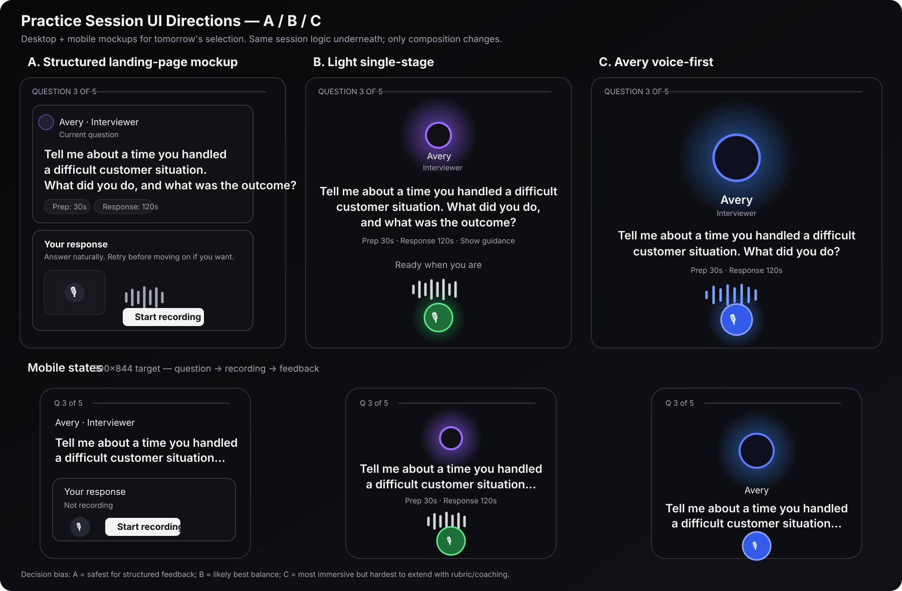

# Practice session UI directions — decision plan

## Purpose

Compare three concrete V2 Practice-session directions before changing the session again. The goal is to pick one interaction model that feels recognisably InterviewGrade, works on desktop and mobile, and gives recording + feedback a clear place without returning to the bulky camera/video-call layout.

This is a design/implementation plan only. No scoring, persistence, feedback API, transcription, TTS, rubric, database, or report behavior changes are part of this PR.

## Shared product constraints

All three directions must keep the current working V2 behavior underneath:

- Avery question TTS + speaking rings
- question order, progress, prep/response timing
- microphone recording / MediaRecorder
- transcription + browser fallback
- answer persistence
- live feedback SSE
- Next question / Finish practice behavior
- final report generation
- current Shadcn/tokens/theme

The permanent camera preview remains out of the normal V2 Practice session. Camera/media infrastructure should not be deleted; it can remain available for future optional body-language work.

## Direction A — Landing-page mockup style (structured)

### Idea

Use the visual hierarchy already shown on the landing-page Practice mockup: a clear question module, a dedicated response module, and explicit room for feedback/rubric context.

### Desktop

- compact session header with progress and End practice
- question card with Avery identity, Listen, prompt, timing, Show guidance
- dedicated `Your response` card below
- visible but compact waveform and Start recording CTA
- feedback replaces/expands the response module after submission rather than creating a third large card
- optional rubric/focus context can live in a small side rail only on wide screens; it must not compete with the question

### Mobile

- single column only
- question card first
- response module directly underneath
- no persistent side rail
- rubric/feedback details move into a Sheet/Drawer if needed
- question + response interaction should fit within one normal viewport where possible

### Strengths

- clearest hierarchy
- easiest place for structured rubric feedback, retry, coaching, and future features
- closest to the current InterviewGrade landing-page promise
- easiest to understand for first-time users

### Risks

- can become card-heavy again
- needs restraint so it does not drift back toward dashboard UI
- mobile needs aggressive density control

## Direction B — Landing-page language + lighter single-stage layout

### Idea

Use the same brand language as Direction A, but remove most visible card boundaries. Avery, question, timing, recording, and feedback live in one central stage with only light separators/background changes.

### Desktop

- centred stage around 760–860px
- Avery presence at top with soft brand glow/ring
- question centred or left-aligned within the same stage
- timing/guidance as small secondary controls
- waveform + mic/stop directly beneath the question
- feedback transitions into the same stage after capture
- no large recorder box and no permanent right rail

### Mobile

- Avery + question + voice control form one viewport
- large touch target for Record/Stop
- feedback appears in-place beneath the interaction, with details on demand
- long prompts get a bounded reading region rather than page-level overflow

### Strengths

- best balance of brand identity + clarity + low visual density
- avoids empty recorder panels
- keeps enough structure for feedback without looking like a dashboard
- likely easiest to make responsive without special desktop/mobile layouts

### Risks

- requires a deliberate JSX refactor rather than CSS layering
- feedback hierarchy has to be very intentional or it can feel visually flat

## Direction C — ChatGPT-voice-style Avery focus

### Idea

Make Avery the primary visual object: large animated presence, minimal chrome, one large voice control, waveform, then feedback replacing the voice state after submission.

This should borrow the interaction principle, not clone ChatGPT styling.

### Desktop

- very minimal header/progress
- large Avery ring/presence
- question below Avery
- one large microphone action
- waveform/status while listening
- feedback replaces the listening state

### Mobile

- Avery dominates the top half
- question + one voice control below
- no secondary panels in the default state
- feedback enters as the next state rather than another card

### Strengths

- most immersive
- clearest audio-first interaction
- strongest distinctive product moment if Avery becomes a real InterviewGrade identity
- least visual clutter during recording

### Risks

- weakest fit for rich rubric feedback, retries, guidance, and future coaching
- can make the product feel like a generic voice assistant rather than interview preparation
- harder to communicate structured evaluation without introducing secondary sheets/panels later

## Shared interaction states to compare

Every direction should be judged across the same states, not only the idle screenshot:

1. **Question ready** — Avery asks the question; Listen available; Record available.
2. **Recording** — immediate acknowledgement; waveform; elapsed time; clear Stop/Finish answer action.
3. **Transcribing/saving** — compact progress state, no full-screen spinner.
4. **Evaluating** — answer is already safe; user can understand feedback is being generated.
5. **Feedback ready** — score/summary/advice visible with clear Next question or Finish practice.
6. **Previous feedback** — useful but not competing with the current question.
7. **Error/fallback** — mic denied, transcription fallback, feedback unavailable.

## Decision criteria

Score each direction 1–5 after testing desktop and 390×844 mobile.

| Criterion | A Structured | B Light stage | C Voice-first |
| --- | ---: | ---: | ---: |
| Clear hierarchy | 5 | 5 | 4 |
| Mobile fit / no normal page scroll | 4 | 5 | 5 |
| Recording focus | 4 | 5 | 5 |
| Feedback integration | 5 | 5 | 3 |
| Rubric/coaching extensibility | 5 | 4 | 3 |
| Feels like InterviewGrade | 5 | 5 | 4 |
| Implementation risk | 4 | 4 | 3 |
| Avoids dashboard/card overload | 3 | 5 | 5 |

Initial read: **A or B are the strongest product fits; B is the likely sweet spot if the mockup still reads clearly in feedback states.** C should only win if the immersive Avery/voice interaction feels materially better in real use and does not make feedback feel bolted on.

## Tomorrow’s review sequence

1. Open the attached A/B/C mockups side-by-side.
2. Compare desktop idle + recording states.
3. Compare 390×844 mobile idle + recording + feedback states.
4. Judge long-question handling.
5. Judge where feedback appears and how much of it is visible without scrolling.
6. Pick one direction before implementing anything else.
7. Close/rework the current experimental #166 rather than layering more CSS onto it if it does not match the selected direction.

## Implementation scope after a direction is chosen

### Reuse unchanged

- `V2SessionPlayer` state/orchestration
- current question/progress logic
- Avery TTS + browser fallback
- answer save actions
- feedback streaming
- completion/report navigation
- shared MediaRecorder/transcription pipeline
- rubric/scoring payloads

### Refactor/build

- explicit `PracticeSessionStage` composition
- explicit `AveryPresence`
- explicit `QuestionStage`
- explicit audio recorder presentation using the existing recorder logic
- explicit feedback presentation
- responsive layout classes/components
- mobile safe-area and viewport handling

### Avoid

- broad `:has()` selectors as the main layout mechanism
- hidden-camera hacks
- duplicated session state
- new recording/transcription infrastructure
- report redesign
- scoring/rubric/API/database changes

## Acceptance criteria for the selected direction

- recognisably InterviewGrade V2
- no visible camera preview in the normal Practice session
- no giant empty recorder panel
- desktop does not look like a dashboard/video-call UI
- mobile does not look like compressed desktop
- normal interaction avoids page scrolling
- question and recording action are visually obvious within one glance
- immediate recording/transcription state acknowledgement
- feedback has an intentional home and does not feel bolted on
- existing session behavior remains intact
